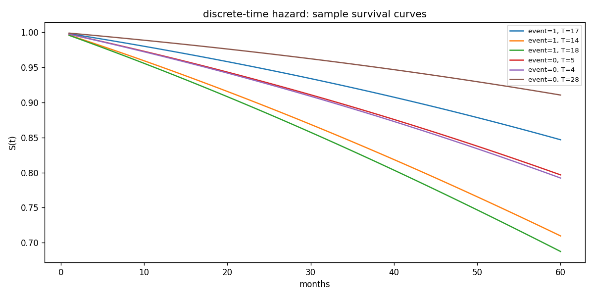
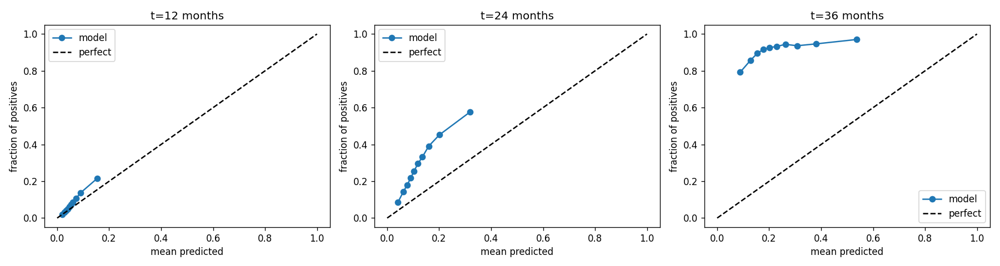

# Time-to-Default Prediction on Loans

Survival analysis pipeline for credit default prediction on LendingClub loans (2007–2018). Instead of classifying *whether* a borrower defaults, the models estimate *when* they will default — producing a full survival curve S(t) for each borrower.

---

## Why Survival Analysis?

Standard classification discards borrowers who are still active when the dataset ends. They haven't defaulted, but they haven't finished repaying either — they're **censored**. Dropping them biases the model toward apparent non-defaulters.

Survival models handle censored observations correctly. The output is a probability curve over time: "what is the chance this borrower is still current at month 12, 24, 36?"

---

## Results

| Model | Val C-stat | Test C-stat | Val Brier t=12 | Val Brier t=24 | Val Brier t=36 |
|---|---|---|---|---|---|
| Cox PH (baseline) | 0.6848 | 0.6931 | 0.0552 | 0.1093 | 0.1346 |
| Discrete-Time Hazard | 0.6850 | 0.6921 | 0.0549 | 0.1092 | 0.1340 |
| DeepSurv | 0.6916 | 0.7015 | 0.0549 | 0.1083 | 0.1341 |

C-statistic measures ranking ability (analogous to AUC). Brier score measures calibration — lower is better, with 0.25 as the naive baseline.

---

## Model Pipeline

Three models are built in sequence, each relaxing a different assumption:

**1. Cox Proportional Hazards** — interpretable linear baseline. Assumes the hazard ratio between any two borrowers is constant over time. Implemented with `lifelines`.

**2. Discrete-Time Hazard** — breaks the timeline into monthly intervals, fits a logistic regression at each interval for "did this borrower default *this month*, given they survived until now?". Survival curve is the product of per-interval survival probabilities. No proportional hazards assumption.

**3. DeepSurv** — keeps the Cox partial likelihood loss but replaces the linear predictor with a feedforward neural network. Implemented in PyTorch. Best test C-statistic of the three models (0.7015).

---

## Sample Output

Survival curves for individual borrowers (discrete-time hazard model):



Calibration at t=12, 24, 36 months:



---

## Repo Structure

```
model_development/
  data_pipeline.ipynb       # download, clean, feature engineering, temporal split
  cox_prop_hazard.ipynb     # Cox PH model — complete
  discrete_hazard.ipynb     # discrete-time hazard model — complete
  deepsurv.ipynb            # DeepSurv neural network — complete
  outputs/                  # saved plots
artifacts/                  # model artifacts for serving (ONNX models, scalers, coefficients)
backend/                    # Spring Boot 4.0.6 REST API (Java 26, ONNX Runtime)
frontend/                   # Next.js 16.2.7 UI (React 19, TypeScript)
data/                       # gitignored — parquet splits live here
```

---

## Running the Application

**Backend** (serves predictions from all three models):
```bash
cd backend
mvn spring-boot:run
# API available at http://localhost:8080/api
```

**Frontend**:
```bash
cd frontend
npm install
npm run dev
# UI available at http://localhost:3000
```

The backend loads model artifacts from `../artifacts` at startup. The frontend dynamically fetches feature columns from the API and submits borrower inputs to `/api/predict`, which returns survival curves from all three models concurrently.

---

## Technical Details

### Dataset

LendingClub accepted loans via Kaggle (`wordsforthewise/lending-club`). ~2.5M rows, ~150 columns. After filtering to usable loan statuses:

- **event = 1**: charged off or defaulted
- **event = 0**: fully paid, current, late, or in grace period (right-censored)
- **duration**: months from issue date to last payment date (minimum 1)

### Train / Val / Test Split

Split is **temporal**, not random, to prevent data leakage and reflect real deployment conditions:

| Split | Period | Rows |
|---|---|---|
| Train | before 2015 | 463,232 |
| Val | 2015 | 420,801 |
| Test | after 2015 | 1,371,471 |

### Features (origination-time only)

Only features available at loan issuance are used. Post-issuance columns (`recoveries`, `total_pymnt`, `out_prncp`, etc.) are excluded to prevent leakage.

```
loan_amnt, int_rate, installment, grade, sub_grade, emp_length,
home_ownership, annual_inc, verification_status, purpose, dti,
delinq_2yrs, fico_score, open_acc, pub_rec, revol_bal, revol_util,
total_acc, term
```

`fico_score` is the average of `fico_range_low` and `fico_range_high`.

### Encoding

| Feature | Encoding | Reason |
|---|---|---|
| `grade` | ordinal A=1 → G=7 | natural risk ordering |
| `sub_grade` | ordinal A1=1 → G5=35 | natural risk ordering |
| `home_ownership`, `purpose`, `verification_status` | one-hot, drop_first | no natural ordering |
| `emp_length` | integer years 0–10, NaN → median | ordinal proxy |

### Discrete-Time Hazard: Person-Period Expansion

Each borrower with duration T contributes T rows to the training set — one per month. The binary target `y=1` only on the final row of a defaulted borrower. This converts the survival problem into tabular logistic regression.

Train set expands from 463K borrowers to ~12.5M person-period rows. The time index `t` is included as a feature so the model can learn time-varying baseline hazard.

### Evaluation Metrics

- **C-statistic (concordance index)**: fraction of all comparable pairs where the model correctly ranks the higher-risk borrower as defaulting sooner. 0.5 = random, 1.0 = perfect.
- **Brier score at horizon t**: mean squared error between predicted survival probability S(t) and actual outcome. Below 0.25 beats the naive all-zeros classifier.

### Cox PH Assumption Check

Schoenfeld residual test (run on 10k training sample) found that 21 of 34 features violate the proportional hazards assumption — including `int_rate`, `grade`, `fico_score`, and `annual_inc`. This motivates the discrete-time and DeepSurv models, which do not require the assumption.

### Libraries

| Purpose | Library |
|---|---|
| Data processing | `pandas`, `numpy` |
| Cox PH | `lifelines` |
| Discrete-time hazard | `scikit-learn` |
| DeepSurv | `pytorch` |
| Plots | `matplotlib` |
